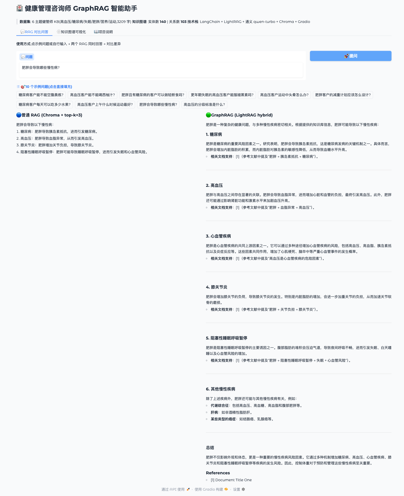
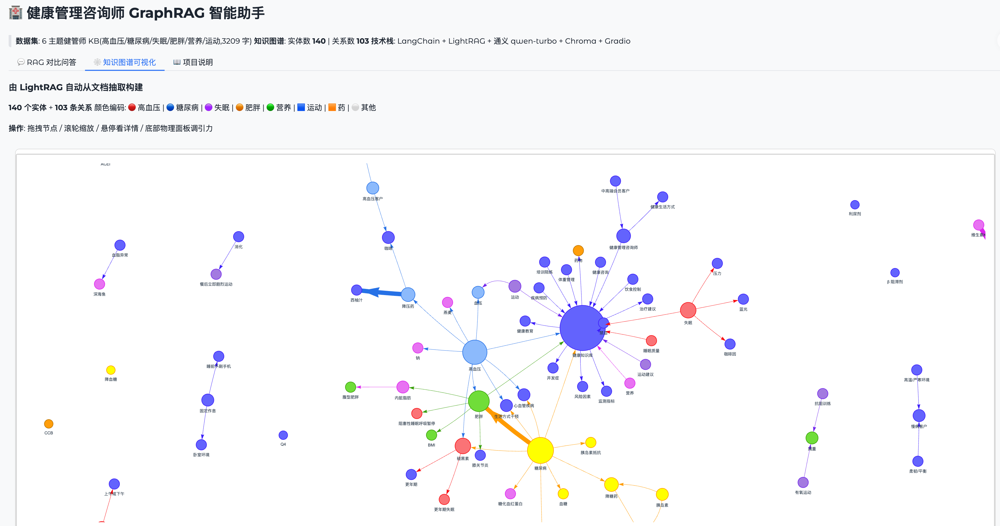
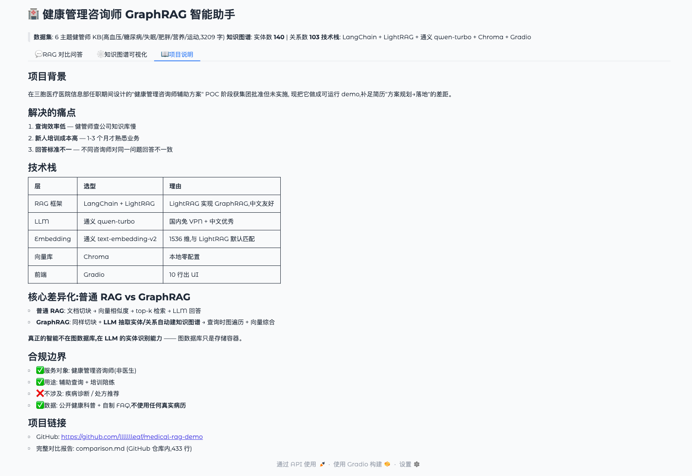

# 健康管理咨询师 GraphRAG 智能助手

> 基于 **LangChain + LightRAG** 的健康管理咨询师业务知识库 demo,**对比展示普通 RAG vs GraphRAG**,验证知识图谱在医疗多跳推理场景的价值。

[](https://www.python.org/)
[](https://github.com/langchain-ai/langchain)
[](https://github.com/HKUDS/LightRAG)
[](./LICENSE)

---

## 📖 项目背景

在三胞医疗医院信息部任职期间,设计的"健康管理咨询师辅助方案"(POC 阶段获集团批准但未实施)的**可运行 demo 实现**。

**真实业务来源**:健管师(非医生角色)的 3 大痛点
1. 查询效率低——面对客户提问时查公司知识库慢
2. 新人培训成本高——1-3 个月才能熟悉业务
3. 回答标准不一——不同咨询师对同一问题回答不一致

**Demo 目的**:把方案规划升级为可运行 demo + 用 GraphRAG 提升多跳推理准确率。

**合规边界**:
- ✅ 服务对象:健康管理咨询师(非医生)
- ✅ 用途:辅助查询知识 + 培训陪练
- ❌ 不涉及:疾病诊断 / 医疗器械级 AI / 处方推荐
- ✅ 数据:公开健康科普 + 自制 FAQ,**不使用任何真实病历数据**

---

## 🎬 Demo 截图

### Tab 1: RAG 对比问答



同一问题让**普通 RAG**(Chroma + top-k 检索) 和 **GraphRAG**(LightRAG hybrid mode) 同时回答,直观对比差异。

### Tab 2: 知识图谱可视化(140 实体 + 103 关系)



用 pyvis 渲染 LightRAG 自动构建的知识图谱:**8 主题颜色编码,可拖拽 / 缩放 / 悬停看实体详情**。

### Tab 3: 项目说明



---

## 🏗️ 技术栈

| 层 | 选型 | 理由 |
|----|------|------|
| LLM | 通义 qwen-turbo | 国内免 VPN + 中文优秀 + 免费额度 |
| Embedding | 通义 text-embedding-v2(1536 维) | 与 LightRAG 默认维度匹配,免维度坑 |
| RAG 框架(基线) | LangChain 1.3.1 | 主流 RAG 框架,生态最全 |
| GraphRAG 框架 | LightRAG 1.4.16 | 北大 HKUDS 团队,比微软 GraphRAG 更轻量 |
| 向量库 | Chroma(普通 RAG) + NanoVectorDB(LightRAG) | 本地零配置 |
| 图谱可视化 | pyvis + NetworkX | 交互式 web 渲染 |
| 前端 | Gradio 5.50.0 | 10 行代码出 UI |

---

## 🚀 快速启动

### 1. 克隆 + 环境

```bash
git clone https://github.com/llllllleaf/medical-rag-demo.git
cd medical-rag-demo

# 推荐 Python 3.12(3.14 太新,LangChain 周边库未完全适配)
python3.12 -m venv venv
source venv/bin/activate
pip install -r requirements.txt
```

### 2. 配置 API Key

注册阿里云 DashScope(<https://dashscope.aliyuncs.com/>)拿到 API Key,然后:

```bash
export DASHSCOPE_API_KEY="sk-你的key"
```

### 3. 跑示例(按顺序)

```bash
# Day 2: LangChain Hello World
python hello.py

# Day 3: 普通 RAG 最小闭环
python rag_minimal.py

# Day 4: LightRAG Hello World(GraphRAG 基础)
python lightrag_hello.py

# Day 5: 用 6 主题 KB 重建知识图谱(10-20 分钟,要调多次 LLM)
python build_graph.py

# Day 5.4: 跑 10 个对比测试(生成 comparison.md)
python compare.py

# Day 6: 启动 Web UI demo
python app.py
# 浏览器访问 http://localhost:7860
```

---

## 🎯 GraphRAG vs 普通 RAG — 对比测试结果

**完整测试报告**: [`comparison.md`](./comparison.md)(433 行,10 个问题全部对比)

**核心结论**:同样数据 / 同样 LLM / 同样 Embedding 下,跑 10 个对比问题:

| 评分 | 数量 | 例子 |
|------|------|------|
| GraphRAG 显著优于 | **3** | Q3 肥胖+糖尿病轻断食 / Q6 肥胖减重计划 / Q9 肥胖导致哪些慢病 |
| GraphRAG 偏强 | 1 | Q7 糖尿病每天水果量 |
| 平局 | **6** | Q1/Q2/Q4/Q5/Q8/Q10(单跳问题两者差不多) |
| 普通 RAG 更好 | 0 | — |

**最强证据**:Q9 "肥胖会导致哪些慢性病?"
- **普通 RAG** 答 4 条慢病
- **GraphRAG** 通过图遍历多跳推理,答 **6 大类**(多了心血管疾病、代谢综合征、肝病、癌症)

**诚实声明**:数据集 FAQ 部分预先写好了多跳答案,所以普通 RAG 也能答得"够用"。**GraphRAG 真正的优势在没有 FAQ 总结的开放问题上**(Q9 这种)——它能从知识图谱跨章节多跳走出来。

---

## 🧠 GraphRAG 核心原理(我对项目的理解)

**核心一句话**: **不是图数据库会关联,是 LLM 帮你关联,图数据库只负责存。**

**3 步工作流**:
1. **切块**(机械切分,无智能)
2. **★ LLM 抽取实体+关系**(智能在这里)— LightRAG 给 LLM 发 prompt,让它返回"实体+关系"的 JSON
3. **跨 chunk 合并去重**(也用 LLM)— 不同章节提到同一实体时合并

**为什么能自动建立跨章节关联**:LLM 训练时看过海量医学文本,内化了"高血压是疾病、卡托普利是 ACEI 药"这种世界知识。读 chunk A 看到"褪黑素 → 慢性病客户慎用",再读 chunk B 看到"高血压是慢性病",LightRAG 第二轮调 LLM 合并时把它们连起来 → 自动跨章节边。

**3 个角色分清**:
- 图数据库(NetworkX) = 空文件柜
- LLM(通义) = 实习生(读文档,贴标签)
- LightRAG = 项目经理(指挥实习生)

---

## 📁 项目结构

```
medical-rag-demo/
├── hello.py                    # Day 2: LangChain Hello World
├── rag_minimal.py              # Day 3: 普通 RAG 5 步最小闭环
├── lightrag_hello.py           # Day 4: LightRAG GraphRAG Hello World
├── build_graph.py              # Day 5: 用 6 主题 KB 重建知识图谱
├── compare.py                  # Day 5: 对比测试主脚本
├── visualize_graph.py          # Day 6: 知识图谱可视化生成
├── app.py                      # Day 6: Gradio 3 Tab UI
│
├── data/
│   └── health_consultant_kb.txt    # 6 主题健管师 KB(3209 字)
│
├── eval_questions.json         # 10 个对比测试问题
├── comparison.md               # 完整对比报告(433 行)
├── test.txt                    # Day 3-4 用的早期单主题测试数据
│
├── screenshots/                # demo 截图
│   ├── 01-rag-compare.png
│   ├── 02-knowledge-graph.png
│   └── 03-project-info.png
│
├── requirements.txt
├── .gitignore
├── LICENSE
└── README.md
```

**注**:`chroma_db_v2/` / `lightrag_storage_v2/` 由代码自动生成(已在 .gitignore),首次跑 `python build_graph.py` 会构建。

---

## 🔧 踩过的坑(完整记录,真实开发故事)

### 坑 1: Python 3.14 太新

系统装的 Python 3.14.3 是 2025/10 新版,LangChain 周边库未完全适配。
**解决**:`brew install python@3.12` 用 3.12 替代。
**教训**:工具链 .0 大版本不要立刻上生产,等社区踩坑 3-6 个月。

### 坑 2: LangChain 1.3 重构 import 路径

```python
# 旧:
from langchain.text_splitter import RecursiveCharacterTextSplitter
from langchain.chains import RetrievalQA

# 新(1.3.x):
from langchain_text_splitters import RecursiveCharacterTextSplitter
from langchain_classic.chains import RetrievalQA
```

**教训**:框架重构期 import 路径不稳,看官方升级指南。

### 坑 3: LightRAG 没有内置通义后端

LightRAG 1.4.16 内置 OpenAI / Anthropic / Zhipu 等,但**没有通义**。
**解决**:通义提供 OpenAI 兼容接口(`https://dashscope.aliyuncs.com/compatible-mode/v1`),用 `openai_complete_if_cache` 函数直接调,等效"伪 OpenAI 调用"。

### 坑 4: Embedding 维度不匹配

text-embedding-v3 默认 1024 维,但 LightRAG 默认期望 1536 维 → 报维度不一致错误。
**解决**:换 text-embedding-v2(1536 维,跟 LightRAG 默认匹配),`EmbeddingFunc(embedding_dim=1536, ...)`。

### 坑 5: 异步事件循环冲突(Gradio + LightRAG 集成)

LightRAG 是异步 API,Gradio 内部也有 event loop。第一版用 `loop = asyncio.new_event_loop() + loop.run_until_complete()`,UI 卡死。
**解决**:把回调函数改成 `async def`,直接 `await graph_rag.aquery(...)`——Gradio 原生支持 async callback,会用它自己的 loop。
**教训**:不要在异步框架里再起新 loop。

### 坑 6: Gradio 6.0 sanitize 删 script 标签

`gr.HTML(pyvis 完整 HTML)` 被 Gradio 6.0 sanitize,导致前端 200+ JS 错误,UI 卡死。
**解决**:
1. 改用 `<iframe src="/gradio_api/file=graph.html">` + `launch(allowed_paths=[...])`
2. 还有错 → 直接**降级到 Gradio 5.50.0**(2024 稳定版)
**教训**:复杂第三方 HTML 不要直接塞进 web 框架 HTML 组件,用 iframe 隔离;.0 大版本生态成熟前不上生产。

### 坑 7: .gitignore 不匹配生成目录

第一次写 `.gitignore` 是 `chroma_db/`,但实际目录叫 `chroma_db_v2/`——不匹配,6MB+ 缓存数据上 GitHub 了。
**解决**:改用通配符 `chroma_db*/` 和 `lightrag_storage*/`,`git rm --cached` 清理。
**教训**:**生成产物 vs 源码** 要分清,任何由代码生成的中间文件都要 ignore。

---

## 🎓 这个项目想证明什么(PjM 视角)

我做这个项目不是为了"会写 RAG 代码"——是为了证明:

1. **业务理解**: 从真实医院 POC 阶段方案出发,明确合规边界(非医生 / 不诊断)
2. **技术选型判断**: 知道 LangChain vs LlamaIndex / LightRAG vs 微软 GraphRAG 的差异和选择理由
3. **数据驱动**: 用 10 个对比测试 + comparison.md 量化"GraphRAG 比普通 RAG 强多少",不是空口说强
4. **诚实复盘**: 6 题平局 / 1 题局限——不假装 GraphRAG 万能
5. **工程素养**: 踩坑 7 个 + 全部修复,生产环境会按问题类型选 mode(simple → naive / complex → hybrid)

---

## 📝 配套博客

- 《从普通 RAG 到 GraphRAG 的实操路径》(待发,maoya.me)
- 《为什么医疗 RAG 必须用 GraphRAG》(待发,maoya.me)

---

## 📬 联系

- 作者: 程智勇
- 博客: [maoya.me](https://maoya.me)
- GitHub: [@llllllleaf](https://github.com/llllllleaf)

---

## License

[MIT](./LICENSE)
